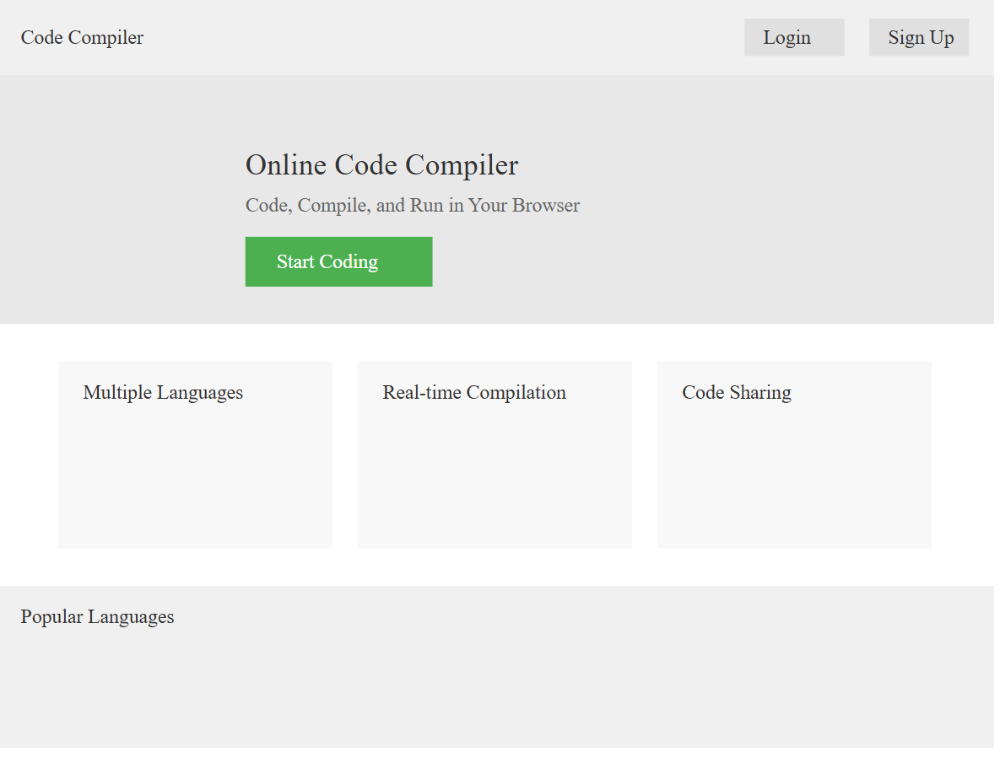
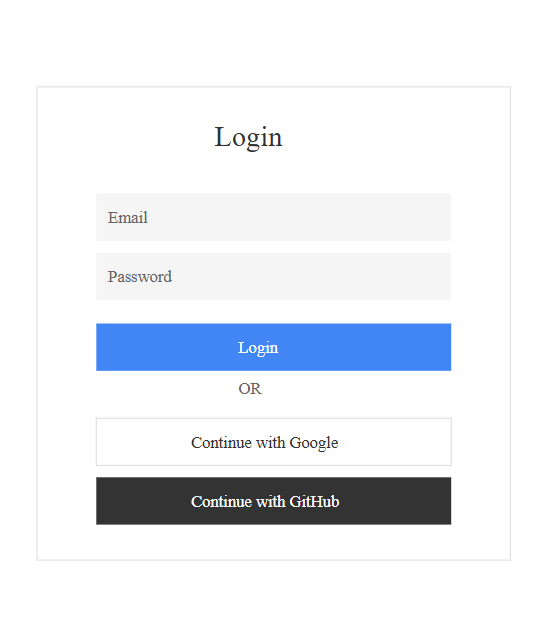
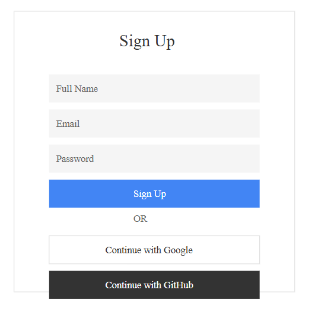
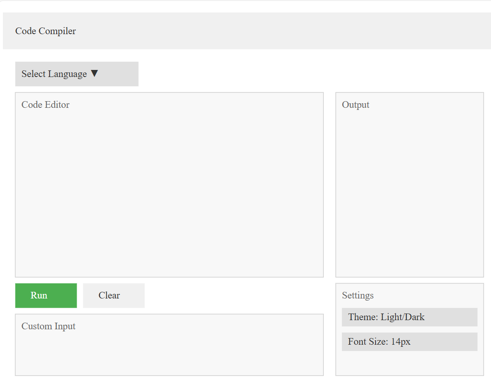
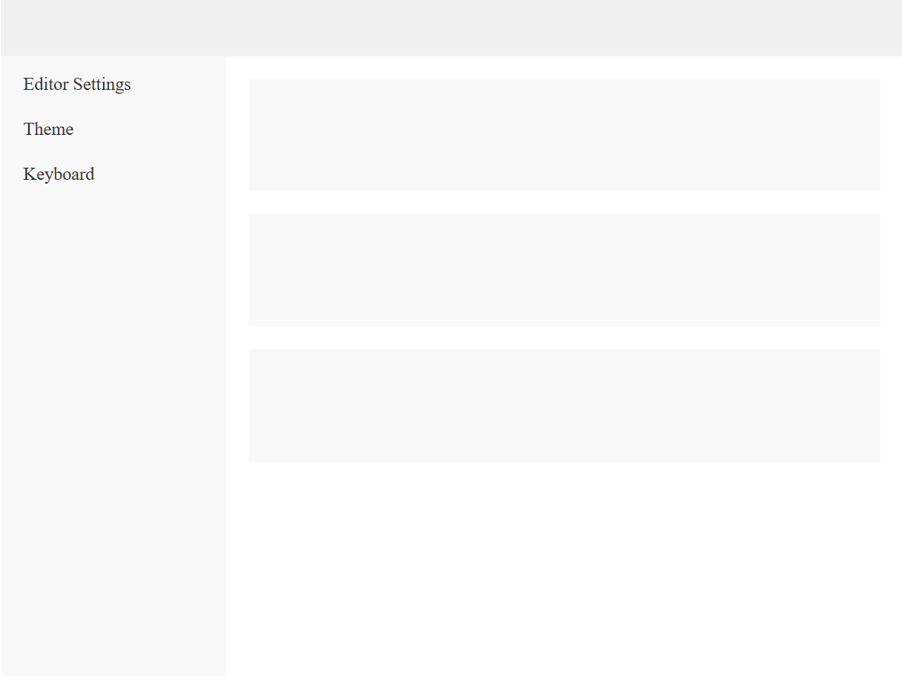
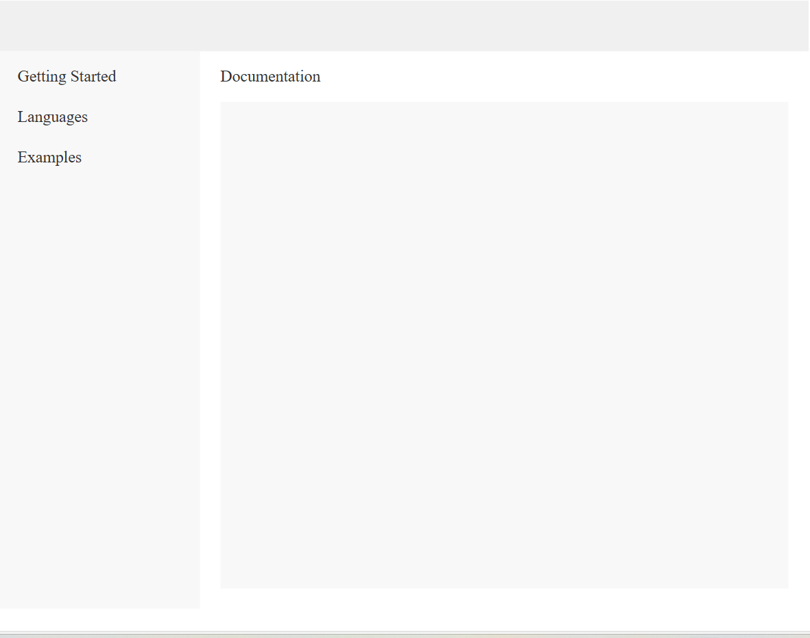
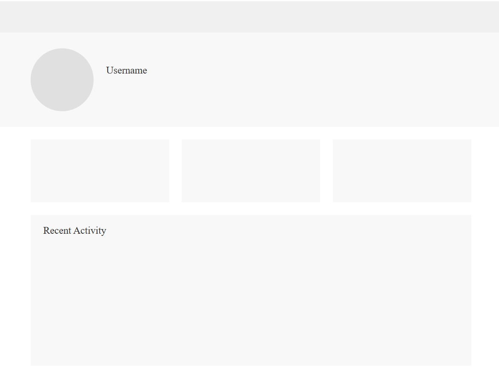

# Pages Structure

## 1. Home Page
- Login or signup buttons
- Quick access compiler
- Featured languages
 
 

## 2. Login 
- login by emailand password.
- login by google or github.
 

## 3. SingnUp
- login by emailand password.
- login by google or github.
 
 

## 4. Code Editor
- Code input area
- Language selector
- Input/Output panels
- Run controls
 
 

## 5. Settings
- Editor preferences
- Theme selection
- Keyboard shortcuts
 
 

## 6. Documentation
- Language guides
- Examples
- API docs
 
 

## 7. Profile
- Saved codes
- History
- Preferences
 
 